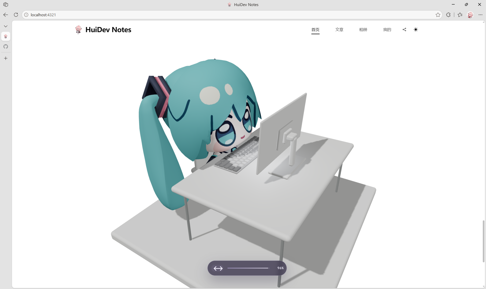
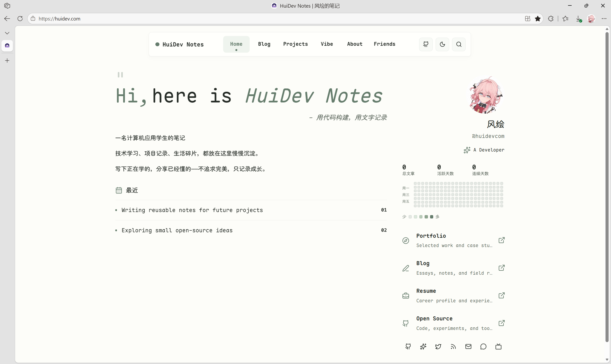

从 2024 年 11 月到现在，我的个人博客一路折腾过来，换过的主题比写过的文章还多。记录一下这个站点的进化旅程，也算是给自己留个存档。

## 1.0 Gmeek：一切开始的地方（2024.11）

刷 B 站的时候刷到一个视频——[「仅需一个 GitHub 账号，让文字在互联网中永生」超轻量级个人博客框架 Gmeek](https://www.bilibili.com/video/BV1GM4m1m7ZD/)。被这句话戳中了，感觉部署也很简单，顺手就搭了起来。那时候还没想清楚要写什么，但「让文字在互联网中永生」这个画面感，确实是我入坑的原点。

## 2.0 WordPress：第一次认真折腾（2025.04）

在某个 Minecraft 服务端 Leaves 的群里，一个群友聊到 iVampireSP 那有个公益 WordPress 主机，一个月五块钱。那时候正好想要部署 WP博客主题 和 MC 服务器网站，顺手就租了。装过 [Argon](https://github.com/solstice23/argon-theme)、[Sakurairo](https://github.com/mirai-mamori/Sakurairo)，也试过官方主题，折腾得起劲。Argon 那会儿还捣鼓过主题的 JSON 配置，改这改那的。

官网应该没多少人看——朋友捧场也好，路过的也好，其实心里清楚，这阶段更多是在享受「我有一个网站了」这件事本身。

## 3.0 遇见 Astro：Fuwari 打开了新世界（2025.05-06）

也是机缘巧合，了解到一个 [Astro](https://astro.build/) 框架的静态博客模板——[Fuwari](https://github.com/saicaca/fuwari)。第一眼就被那种流畅、干净、轻快的风格吸引了，而且那会儿它在社区挺火的。

**Fuwari 最打动我的地方是「干净」**。它没有把一堆功能塞给你，而是提供了一个足够优雅的基底，让你可以按需添加。这种「少即是多」的设计哲学，在整个 Astro 主题生态里都算难得的。

性能上，Fuwari 默认就是 **SSG（静态站点生成）**，所有页面在构建时就已经生成好 HTML，访问时直接丢给浏览器，几乎没有服务端处理时间。配合 Astro 自带的 **岛屿架构**——只有需要交互的部分才会加载 JavaScript，其余全是纯静态——首屏加载极快。

我开始在 Fuwari 上东拼西凑，四处找别人博客的页面教程代码加上去，同时在这个过程中了解到了 [Giscus](https://giscus.app/) 和 [Twikoo](https://twikoo.js.org/) 这两个评论系统。但加的东西一多，性能就开始往下掉——加载变慢、编译也变慢。那时候还不懂优化，觉得「功能越多越好」。

后来回头看，这其实不是 Fuwari 的问题，是我的问题——功能堆叠的代价，最终都会体现在性能上。Fuwari 本身很轻，但经不住我什么都想塞进去还不做优化。

## 4.0 Mizuki：第一次战略性放弃（2025.08）

高一快开学了，终于买了台电脑——在此之前，所有编辑都是拿手机硬肝的（

通过 B 站的宣传视频发现了 [Mizuki](https://github.com/matsuzaka-yuki/Mizuki)——同样是 Fuwari 系的主题，但把我需要的一些常用功能整合到了一起并做了优化。省心很多。

但人就是这样，用着省心的，心里又痒痒想自己折腾。我试图用原版 Fuwari 自己搓一个主题出来，断断续续搞了两三天，最终还是屈服了，老老实实用回 Mizuki。

也就是那段时间，给 Mizuki 绑了第一个备案域名——`fhowo.top`，7 月 21 日提交、8 月 8 日通过的。

之后的日子里没怎么大改，就是时不时逛逛 Astro 官方收录的主题，看看有什么新鲜的。

## 5.0 Firefly：功能党的胜利（2026.04-05）

今年四月了解到 [Firefly](https://github.com/CuteLeaf/Firefly)，还是 Fuwari 系列。相比 Mizuki，Firefly 的一些页面更符合我的口味，优化也不错。决定重新买个域名——`huidev.com`，第二天提交备案申请，6 月 15 日通过，连忙配好 Firefly 上线，6 月 20 日正式见人。备案折腾一次是新鲜，折腾三次就是耐力赛了。

## 6.0 自己写主题：一坨屎的浪漫（2026.06）

脑子一热，决定自己写一个 Astro 博客主题。AI 帮了大忙，出了一个能用的版本——[Shadcn](https://ui.shadcn.com/) 风格，有首页 Banner、水波纹、打字机效果、毛玻璃胶囊导航栏……一大锅大杂烩。

说实话，主页还挺像样的。banner随机封面图、水波纹和打字机效果也让我得意了一会儿。但是文章页没写好——TOC 样式怎么调都不对，文章排版看着就是不舒服。后来就再也没有写出那么像样的版本了。

这坨屎是我最满意也最不满意的作品。

## 7.0 NewEchoes：MMD 模型与性能的较量（2026.07.07-10）

逛 Astro 官方收录主题的时候，筛了一遍又一遍，终于找到了 [NewEchoes](https://github.com/lsy2246/newechoes)。Fork、修改、自己加了 WebDAV 支持、番剧计划 [Bangumi](https://bgm.tv/) 页面、友情链接……几乎每项改造都很满意。

直到我做了那个改动——把默认的 3D 模型换成了在网上找的一个 Miku MMD 模型。

模型非常棒，实时着色的效果也很惊艳，只有一个问题：**卡**。首页的 3D 模型实时渲染对移动端一点都不友好。我试着优化了一下加载策略——从文章页或其他页面跳转回首页时弹窗询问是否进入。但懂的人都知道，这只是扬汤止沸。

最终不得不承认，这个版本的体验配不上它的颜值喵~

## 8.0 Astro-Navfolio：短暂的审美出轨（弃用）

弃用 NewEchoes 后找到了 [Astro-Navfolio](https://github.com/dodolalorc/astro-navfolio)，风格确实好看，代码结构也很有个性——整个网站配置只有一个 TOML 文件。配置了一番感觉还不错，但代码结构对我来说实在太复杂了，而且页面过渡动画感觉比我用过的其他主题慢了一拍。

新鲜感一过就弃用了。

## 9.0 回到 Firefly：累了，不想改了

折腾了一大圈，我回头看了一眼 Firefly，突然觉得——这个东西流畅又够用，功能也齐全，就这样吧。

从 Mizuki 到 Firefly 到 NewEchoes 再到回到 Firefly，这个循环看起来很滑稽，但只有自己知道，每一次切换背后都是对「理想的博客」的想象在变。曾经觉得越花哨越好，后来觉得越个性越好，到头来发现——**稳定能写，比什么都重要。**

累了，不想改了。这个站，就先这样吧。

Firefly 和 Mizuki 之所以体验好，是因为它们在 Fuwari 的基础上做了**合理的功能整合与优化**，而不是无脑堆料。这也是我最后回到 Firefly 的原因——它把「我想要的功能」和「性能」平衡得最好。

Fuwari 底子很好，但**怎么用它，决定了它的上限和下限**。我花了快两年才明白：不是功能越多越好，而是**够用且流畅，才值得长期相处**。

---

## 写在最后

从 Gmeek 到 WordPress，从 Fuwari 到 Mizuki、Firefly，再到 NewEchoes、Navfolio……折腾了这么一大圈，真正发出去的文章其实没几篇，甚至还有 MD 文件丢了的惨案。

但这条路走过来是值得的。每一次换主题、每一次踩坑、每一次写代码写到凌晨然后推翻了重来，都是我在塑造这个「小破站」的过程，也是这个过程塑造了我。

回想起来，最怀念的反而不是哪个主题最好看，而是那些深夜对着主题 翻文档，改配置，再报错，再改。一遍遍刷着 npm or pnpm and `bun  run dev` 等待页面刷新，看到预期的效果出现时，那种满足感很纯粹。

也正因为折腾了这么多，我才慢慢摸清楚自己真正想要的是什么。不是最炫酷的 3D 模型，不是最花哨的交互效果，而是一个能让我安心写字、不会在打开时犹豫几秒的地方。

Firefly 可能不是终点，但至少现在是那个「对」的答案。

博客进化史讲完了。下一篇，该好好写文章了。

---

- *写于 2026 年 7 月 12 日*
- *Codex* 与 *DeepSeek* 进行润色，查看没问题、保持真实性发表~
- *最后修改日期 2026 年 7 月 13 日*