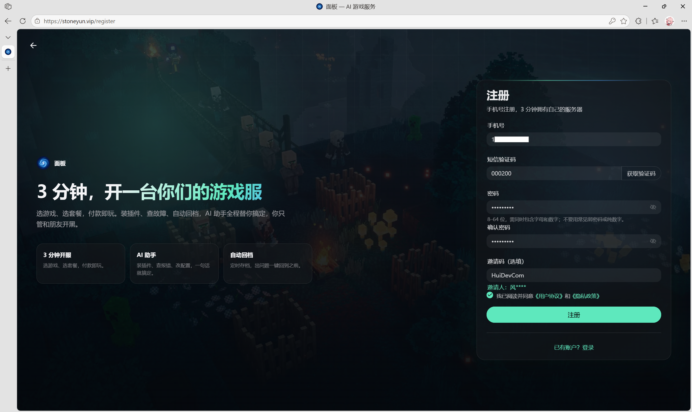
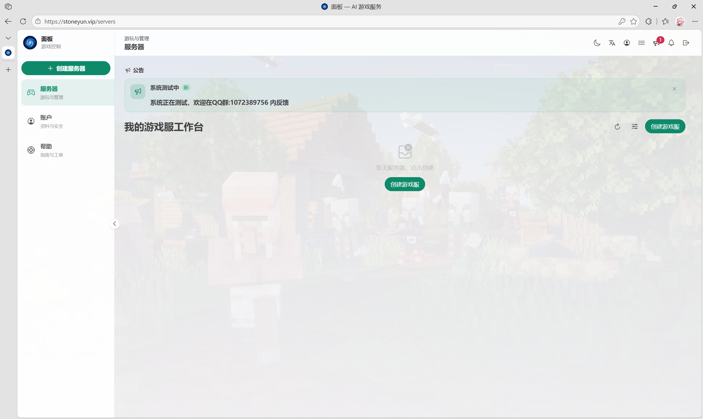
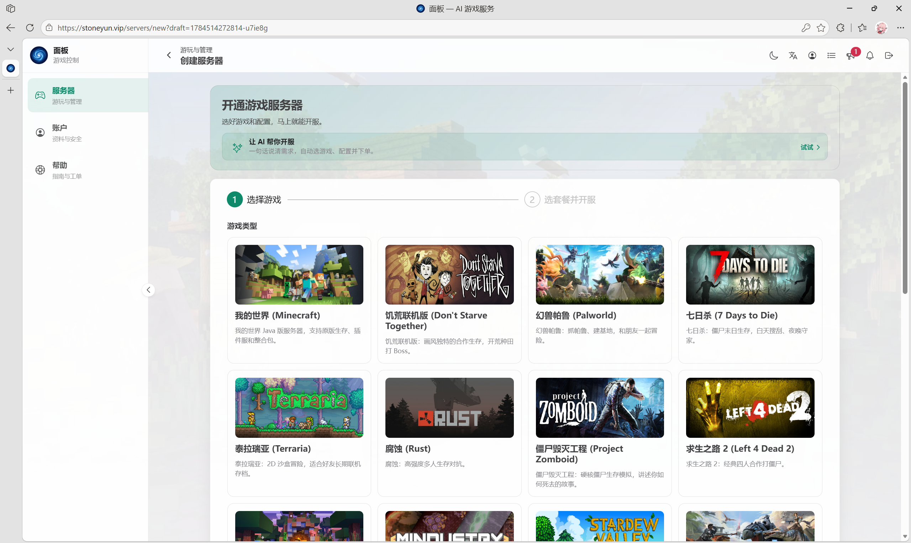
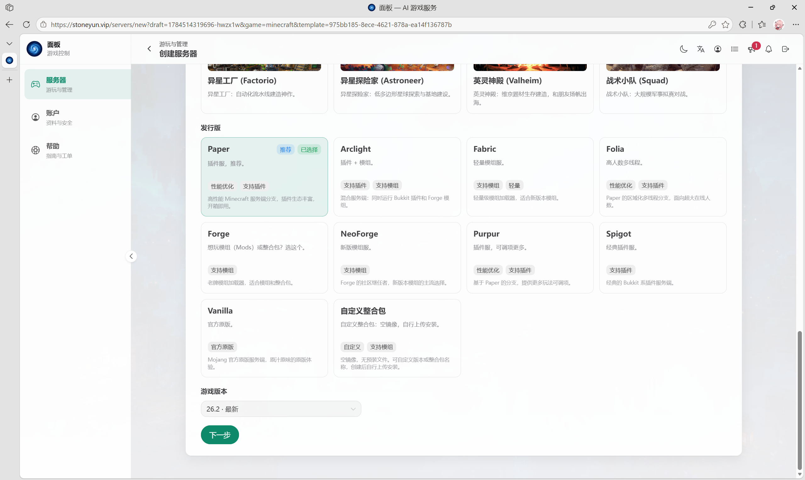
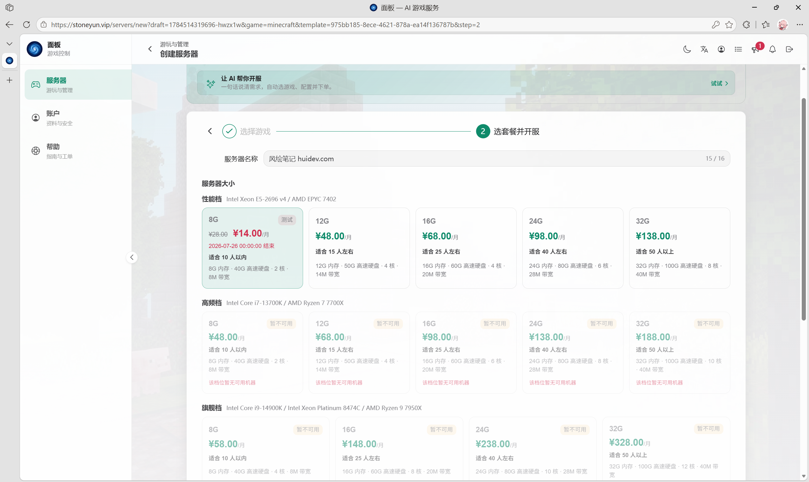
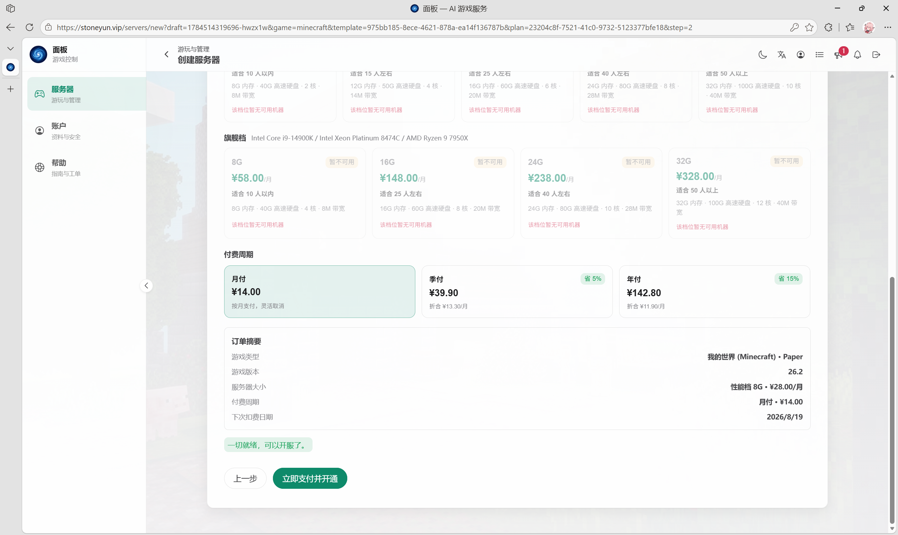
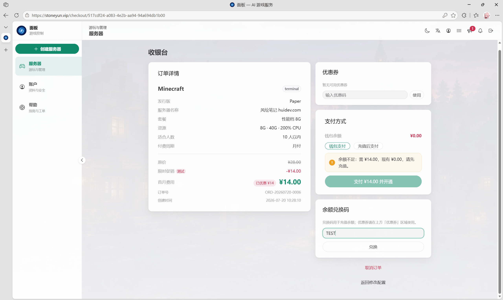
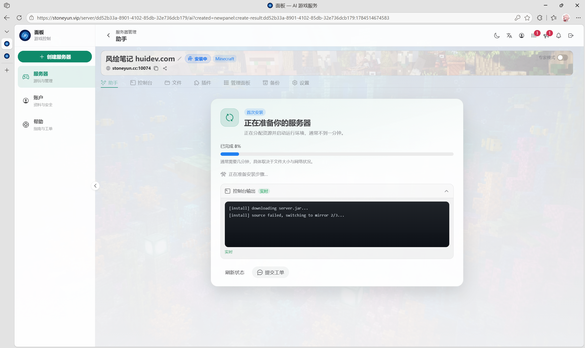
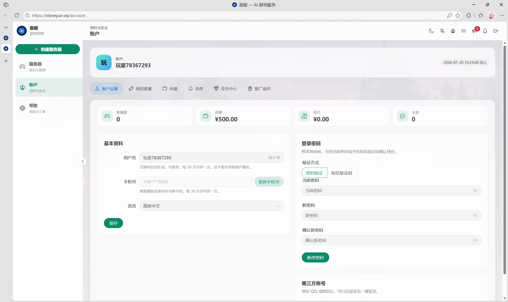

> 写给不懂服务器、不懂代码、想要跟朋友联机的你

[**点此快速注册**](https://stoneyun.vip/register?ref=HUIDEVCOM)（邀请码已自动填充）；**邀请码**：`HuiDevCom`，**CDK**：`TEST`

## 这篇文章是给谁看的？

- 你想玩 Minecraft、饥荒、幻兽帕鲁，但不想花钱买大厂昂贵的游戏服
- 你搜过“怎么开服”，看到一堆 Linux 命令、端口映射、Java 环境就关了
- 你只想有个地方跟朋友联机，不想当运维
- 你甚至不知道“服务端核心”是什么东西——没关系，我也不打算教你

如果你符合以上任意一条，**这篇教程就是为你写的**。

---

## 星石云是什么？一句话说清楚

星石云（Stoneyun）是一个**游戏服务器托管平台**，它把开服这件事变成了：

> 选游戏 → 选配置 → 付钱 → 等着用 → AI Agent 管理服务器

不需要你自己装系统、配环境。它自带的 **AI 运维助手**，让你直接用中文下指令，比如“帮我装个登录插件”，它自己会去搞定。

**价格**：最便宜的套餐 14 块钱一个月，够 10 个人玩。**但跟着本教程使用兑换码 `TEST`，首月实付 0 元。**

---

## 全程实操步骤

### 第一步：注册账号

访问 [星石云](https://stoneyun.vip/register?ref=HUIDEVCOM)

你会看到注册界面：

照着填：

| 字段 | 怎么填 |
|------|--------|
| **手机号** | 填你的真实手机号，要收验证码 |
| **短信验证码** | 点“获取验证码”，等几秒收到短信填进去 |
| **密码** | 至少 8 位，包含字母和数字，比如 `MyServer2026` 这种 |
| **确认密码** | 再输一遍 |
| **邀请码** | 已自动填入，无需改动 |

勾选同意协议，点 **“注册”**。

> 💡 注册完会自动登录，你会进入面板页：

---

### 第二步：选择游戏

在面板页面，点击中间那个大按钮 **“创建游戏服”**，或者左侧菜单的“服务器” → “创建服务器”。

这时候你会进入“选择游戏”页面：

这里有两种创建方式。**本教程我们跟着方式二（手动选）走**，每一步都看得见，对小白最友好。方式一（AI 智能推荐）你可以以后自己探索。

#### 方式一：让 AI 帮你选（适合有明确想法但不知道选哪个游戏的人）

- 在上面的输入框里，用大白话说你的需求  
  比如：*“我想跟 5 个朋友玩我的世界生存模式，要能装插件”*
- 可以打字也可以点语音输入
- AI 会自动推荐合适的游戏和配置，你确认就行

#### 方式二：手动选（本教程采用这种方式）

- 直接点游戏封面，比如 **“我的世界（Minecraft）”**

---

### 第三步：选择服务端核心（也就是“版本类型”）

选完游戏后，会进入“发行版”选择页，这一步可能会让你有点懵，但别怕，每个选项旁边都有中文解释：

**小白直接选带有“推荐”标签的 Paper**，它是大多数插件的首选，稳定好用。

如果你想玩模组（比如暮色森林、工业时代），就选 **Forge** 或 **Fabric**。

如果你想什么都不加，玩原版，就选 **Vanilla（官方原版）**。

选好后，下面一般会有一个“游戏版本”下拉框，默认是“最新”，保持默认就好。

点 **“下一步”**。

---

### 第四步：选配置（核心是“你有几个朋友”）

这一步是选服务器的性能，也就是“多大内存、多快 CPU、多大带宽”。

**不要看那些 CPU 型号、内存数字，你只需要看“适合人数”**。

| 你想几个人玩 | 选这个配置 | 原价 |
|------------|-----------|------|
| 3~5 个好友 | 8G（适合 10 人以内）| ¥14/月 |
| 10~15 人 | 12G（适合 15 人左右）| ¥28/月 |
| 20~30 人 | 16G 或 24G | ¥48~¥68/月 |

我建议第一次先选 8G 性能档，够用又便宜，以后人多了可以随时升级。

选好套餐后往下滚，选择付费周期：

- **月付**：灵活，随时可以取消
- **季付/年付**：有优惠（省 5%~15%），如果你确定长期玩，选年付最划算

确认无误后，点 **“立即支付并开通”**。

---

### 第五步：先兑码，再支付（重点！）

进入收银台后，你会看到这个界面：

**🔥 重点操作顺序（先兑码，再支付，否则会失败）**

1. 先把页面上的 **余额兑换码 `TEST`** 输入到兑换框中，点击兑换。
2. 确认顶部余额变成了 **500 元**（此时订单应付金额会显示为 **¥0.00**）。
3. 最后选择 **“钱包支付”**，点击后不花一分钱，直接跳转安装页面。

> ⚠️ 注意：如果不先兑换就点支付，余额不足会导致支付失败。请一定按上述顺序操作！

---

### 第六步：等待安装（大约 1~3 分钟）

支付成功后，页面会自动跳转到服务器的“安装中”界面：

你看到的应该是这样的：

- 顶部有服务器名称和地址（比如 `stoneyun.cc:10074`）
- 中间有进度条，写着“已完成 8%”
- 下面有控制台日志，正在显示 `downloading server.jar...`

**不用管它**，它自己在装。通常一分钟左右就会完成，最多不会超过五分钟。

你可以时不时点一下 **“刷新状态”** 看看进度。

> 💡 利用这一两分钟的等待时间，你可以先去打开游戏客户端，准备好连接。

当状态变成 **“运行中”**，就说明服务器已经准备好了！

---

### 第七步：进入游戏

安装完成后，把顶部显示的服务器地址（IP + 端口），比如 `stoneyun.cc:10074`，发给朋友。

让他们在游戏里（比如 Minecraft 的“多人游戏”中）添加这个服务器，就能连进来玩了。

---

## 日常管理：账户中心

登录后点击右上角头像 → **账户**，可以在这里：

- **修改密码**：资料与安全 → 登录密码
- **绑定第三方**：资料与安全 → 第三方账号（绑定 QQ 或微信后可一键登录）
- **查看余额**：左侧余额菜单
- **套餐管理**：我的套餐菜单

---

## 常见问题（小白版）

**Q：我选错配置了，能换吗？**  
A：可以。在收银台页面点“返回修改配置”就行。如果已经付款了，可以在服务器管理面板找“升级配置”或联系客服。

**Q：兑换码 TEST 显示无效或过期怎么办？**  
A：该 CDK 当前有效。如果提示无效，请检查是否有多余的空格，或直接联系右下角客服手动补发。

**Q：不想续费了怎么取消？**  
A：月付的话，在“我的套餐”里可以取消自动续费。到期后服务器会自动停用，不会多扣钱。

**Q：朋友连不上怎么办？**  
A：先确认服务器状态是“运行中”。然后把地址和端口（冒号后面的数字）完整复制给朋友，别漏了端口。

---

## 最后说两句

这篇教程没有出现一行代码、一个命令行，因为本来就不需要。

星石云把开服这件事封装成了“选游戏 → 选人数 → 付钱 → 等几分钟”的流程，剩下的全是自动化 + AI 接管。

如果你只是想跟朋友有个稳定联机的地方，花 14 块钱试一个月，我觉得不亏——何况跟着本教程用 `TEST` 码，首月等于白送。

*如果你在操作过程中遇到问题，可以向服务器AI提问，或者加入星石云的 QQ 群（首页公告里有）。*